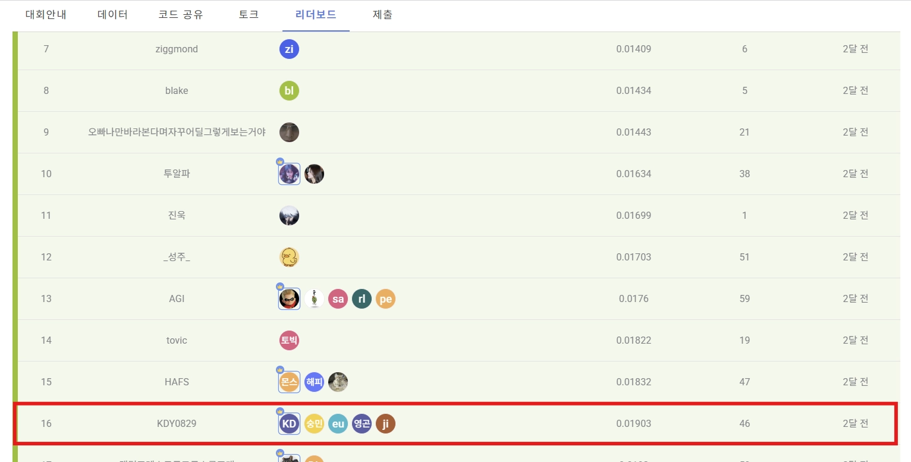
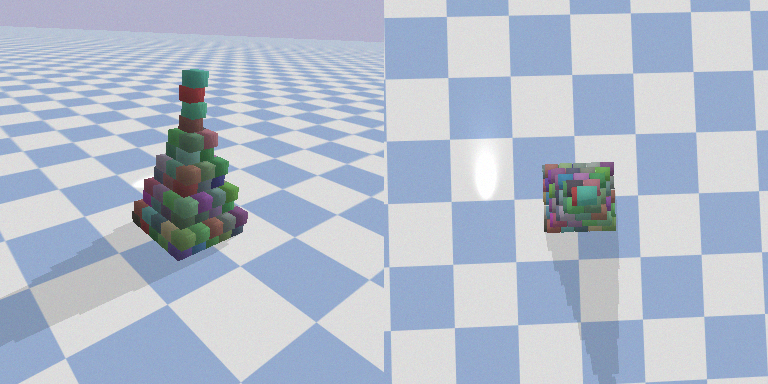

# DACON 구조물 안정성 추론

> 구조물의 front/top 이미지를 기반으로 안정성 확률을 예측한 Dual-View Vision Classification 실험

<p align="center">
  
</p>

## ✨ Highlights

| 구분 | 내용 |
|---|---|
| 대회 | DACON 구조물 안정성 추론 공모전 |
| 성과 | 최종 16등 / 상위 4%, Private LogLoss 0.01903 |
| 접근 | Segmentation 전처리 + Dual-View Classification |
| 담당 | HSV Smart Box, SAM2 기반 전처리, ConvNeXt 실험, 후처리 전략 |

---

## 1. 프로젝트 개요

이 프로젝트는 구조물의 front / top 두 시점 이미지를 기반으로 적재 상태의 안정성을 예측하는 비전 분류 공모전 실험입니다.

단순한 이미지 분류가 아니라 배경, 그림자, 시점 차이, 구조물의 기울기와 배치 정보를 함께 고려해야 했기 때문에, Segmentation 전처리와 Dual-View Classification 구조를 중심으로 실험했습니다.

---

## 2. 데이터 및 문제 구조

<p align="center">
  
</p>

```text
front image
      +
top image
      ↓
segmentation / preprocessing
      ↓
dual-view classification
      ↓
stable / unstable probability
```

---

## 3. My Role

- 데이터 전처리 및 Segmentation 파이프라인 설계
- HSV Smart Box 기반 구조물 영역 추출 실험
- SAM2를 활용한 객체 마스크 생성 실험
- RGB + Mask 4채널 입력 구조 실험
- ConvNeXt 기반 안정성 분류 모델 실험
- TTA, Temperature Scaling, Prediction Clipping 등 LogLoss 개선 후처리 적용

---

## 4. Experiment Focus

| 실험 | 목적 |
|---|---|
| HSV Smart Box | 색공간 기반으로 구조물 후보 영역 탐색 |
| SAM2 Segmentation | 배경과 그림자를 제거한 객체 마스크 생성 |
| Depth-Anything-v2 | 깊이 정보를 활용한 객체 분리 가능성 검토 |
| RGB + Mask 4채널 입력 | 구조물 영역 정보를 분류 모델 입력에 직접 반영 |
| Dual-View Fusion | front / top 시점 정보를 함께 사용 |
| Calibration | LogLoss 기준에서 과도한 확신 완화 |

---

## 5. Pipeline

```text
Data Split
  → Segmentation Research
  → HSV Smart Box + SAM2 Mask Generation
  → RGB + Mask Dataset 구성
  → ConvNeXt / Swin 기반 분류 실험
  → TTA / Temperature Scaling / Prediction Clipping
  → Submission
```

---

## 6. 주요 파일

| 파일 | 설명 |
|---|---|
| `data_segmentation.ipynb` | Segmentation 연구 및 최종 전처리 파이프라인 |
| `data_split.py` | 학습/검증 데이터 분리 자동화 |
| `5_fold.ipynb` | RGB + Mask 4채널 baseline pipeline |
| `5_fold_v2.ipynb` | 384px 고해상도 입력 및 ConvNeXt-Base 실험 |

---

## 7. Tech Stack

| 영역 | 기술 |
|---|---|
| Language | Python |
| Framework | PyTorch |
| Backbone | ConvNeXt, Swin Transformer |
| Segmentation | SAM2, HSV Smart Box, Depth-Anything-v2 |
| Augmentation | Albumentations |
| Validation | Stratified 5-Fold |
| Post-processing | TTA, Temperature Scaling, Prediction Clipping |

---

## 8. Repository

- [KDY0829/dacon-data-segmentation_and_train](https://github.com/KDY0829/dacon-data-segmentation_and_train)
